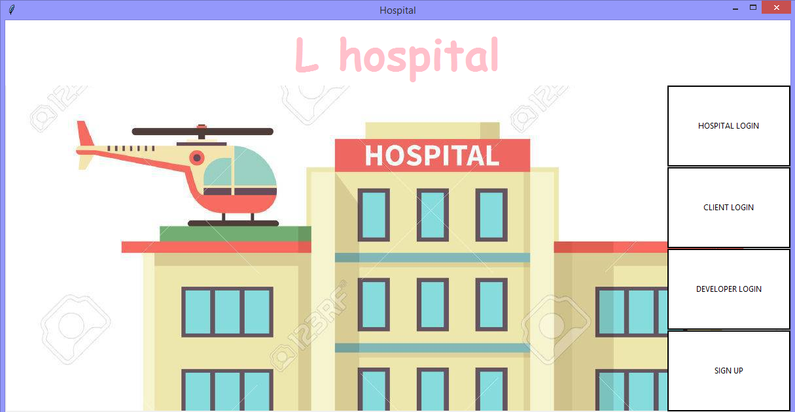
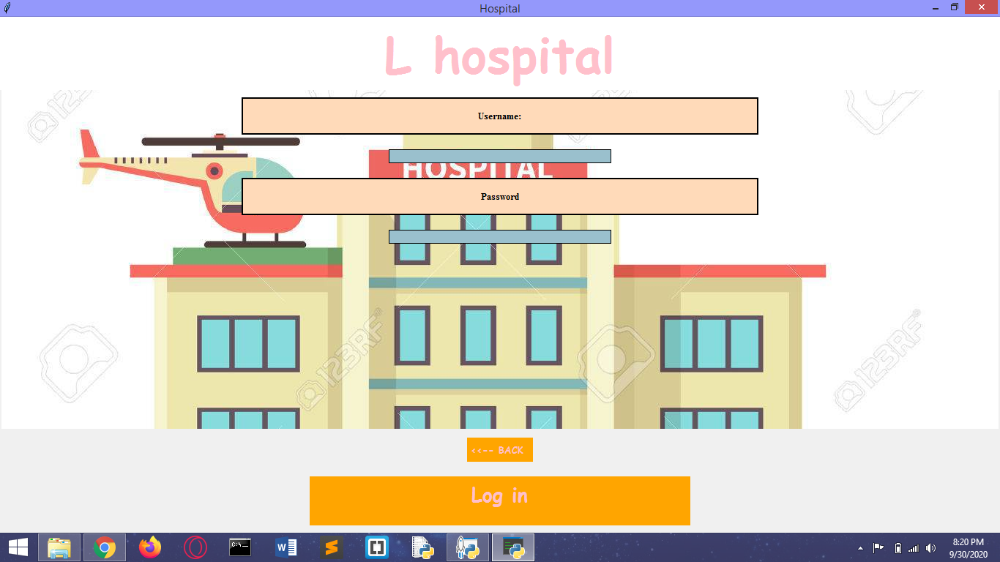
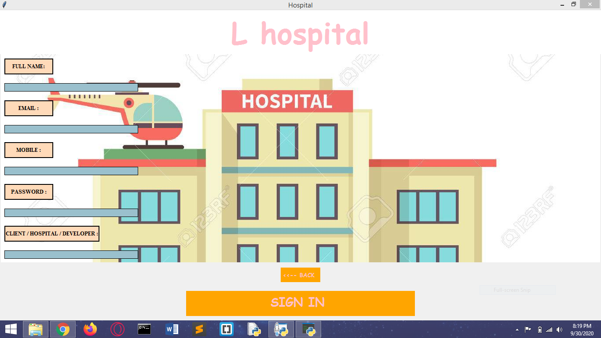

# L-HOSPITAL
THIS PROJECT IS FOR FINDING HOSPITAL NEAR YOU AND USING ITS DATA . THIS PROJECT IS DONE BY SURAJ SINGH UNDER  SUPERVISION OF INSTRUCTOR OF CODING BLOCKS.   THIS PROJECT IS CREATED AS AN PROJECT FOR PYTHON APP DEVELOPMENT COURCE STARTED ON 14TH JUNE,2019 AT CODING BLOCKS PRITUMPURA.
IT IS BASED ON TKINTER

### Screenshots

> Home Page

> Login Page

> Signup Page

